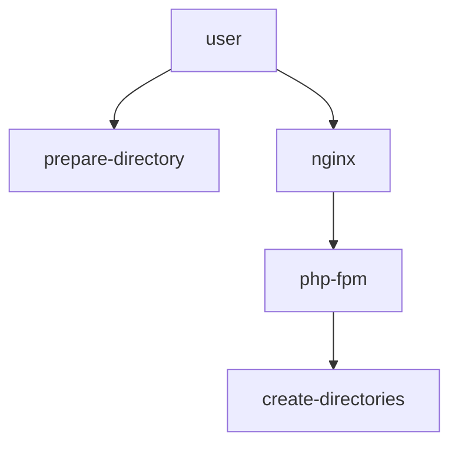

# s6-cli: CLI for s6-overlay
This cli tool can be used to help you setup your projects s6-overlay files and directories. It can also be used to create, remove and lint services.

## s6-overlay
> s6-overlay is an easy-to-install (just extract a tarball or two!) set of scripts and utilities allowing you to use existing Docker images while using s6 as a pid 1 for your container and process supervisor for your services.
To know more about s6-overlay visit [github.com/just-containers/s6-overlay](https://github.com/just-containers/s6-overlay).


## Setup

```bash
git clone git@github.com:dazz/s6-cli.git
cd s6-cli
make help
```

There is a Makefile that you can use to execute helpful commands. Following is a small list for some more important targets.
Run `make` or `make help` to see all possible targets.

## Build
 There are a few options here how you can install the executable on the target system.

### Go
Builds the executable and places it in the current directory
```bash
make build
```

### Nix shell
If you have nix-shell you can run the following command to get a shell with the cli installed
```bash
make nix
```

### Docker
Creates a docker image with the cli installed
```bash
make docker
```

or if you pulled the image from dockerhub
```bash
docker run -it --rm -v ./examples/s6-overlay:/etc/s6-overlay hakindazz/s6-cli:latest
```


### In Dockerfile
If you want to use the cli in a Dockerfile you can copy it from the docker image
```dockerfile
COPY --from=hakindazz/s6-cli:latest /app/s6-cli /usr/local/bin/s6-cli
```

## Usage

There is a help command that you can use to get more info about the commands in the cli. Run it with
```bash
./s6-cli help
```
### The option `--root-path {path}, -p {path}` 
All commands need the `root-path` to be specified. It must point to the directory where services will be defined. 
Default is set to `/etc/s6-overlay/s6-rc.d`

### Create
There are three types of services that can be created: Oneshot, Longrun and Bundle.
Read more about them [here](https://skarnet.org/software/s6-rc/s6-rc-compile.html)

```bash
./s6-cli  --root-path {path} create {oneshot|longrun|bundle} {service}
```

### Remove
If the service is not needed anymore it can be removed with the following command.

```bash
./s6-cli remove {service}
```

### Lint

```bash
./s6-cli lint
```


### Mermaid
This command will generate a mermaid graph of the services.

```bash
./s6-cli mermaid > mermaid.md
```

Or pipe it directly to a markdown file
```bash
./s6-cli mermaid > mermaid.md
```

The output will look something like this:
```bash


which will be rendered to this:


